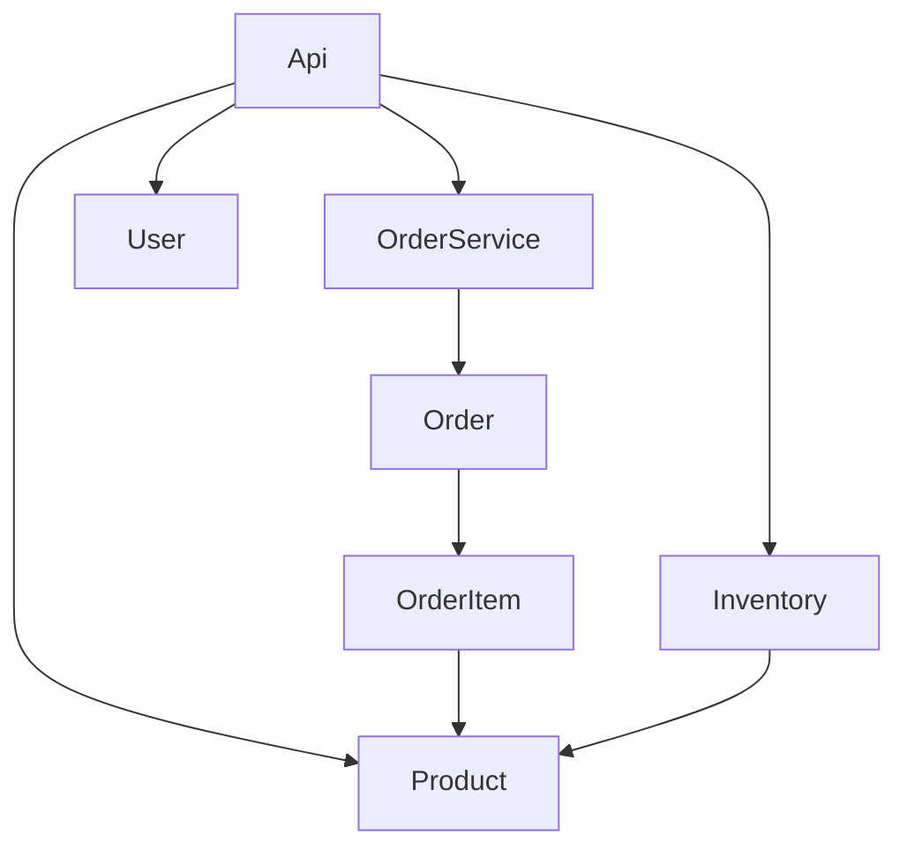

# Graphify Demo

Demo de **Graphify** — el knowledge graph que tu IA recorre en vez de hacer grep.

Este repo fue mapeado con `graphify . --code-only` (100% local, 0 tokens de LLM). El resultado:
`graph.json` (grafo completo) + `graph.html` (navegable) + `GRAPH_REPORT.md` (god nodes y comunidades).

## 🌐 Landing

👉 **[Abrir la landing interactiva →](https://graphify-demo.vercel.app)**

## 🔍 El grafo



- **35 nodos** · **61 aristas** · **5 comunidades**
- **93% EXTRACTED** (leído del código) · 7% INFERRED (resuelto por graphify)
- Costo: **0 tokens de LLM** — parseado con tree-sitter AST, local.

## 🚀 Cómo reproducirlo

```bash
uv tool install graphifyy     # instalar CLI
graphify install               # registrar skill en tu asistente

# construir el grafo de un repo (solo código, local y gratis)
graphify . --code-only

# generar reporte + graph.html navegable
graphify cluster-only .
```

## 💬 Consultas (salida real)

```bash
graphify explain OrderService
# --> .checkout() [method] [EXTRACTED] orders.py:L88

graphify path Product Inventory --undirected
# Product <--imports [EXTRACTED]-- api.py --imports [EXTRACTED]--> Inventory
```

## 📁 Estructura

```
graphify-demo/
├── index.html        # landing con el grafo embebido
├── graph.html        # knowledge graph interactivo (generado por graphify)
├── demo_app/         # mini API de ejemplo (órdenes/inventario)
│   └── src/
│       ├── orders.py
│       └── api.py
└── graphify-out/
    ├── graph.json    # grafo completo (consultable)
    └── GRAPH_REPORT.md
```

## 🔗 Referencia

- [Graphify Labs / graphify](https://github.com/Graphify-Labs/graphify)
- Hecho con el motor [Hermes Agent](https://hermes-agent.nousresearch.com)
